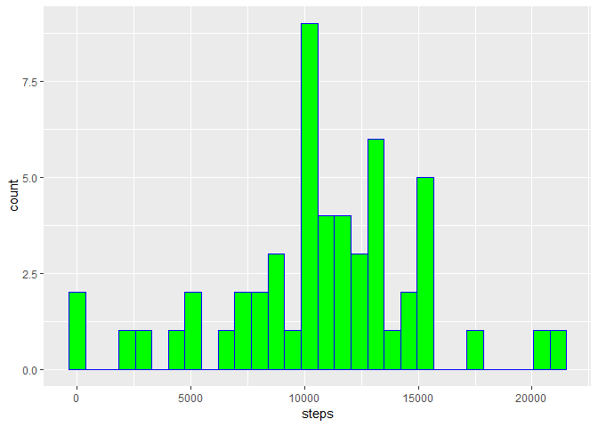
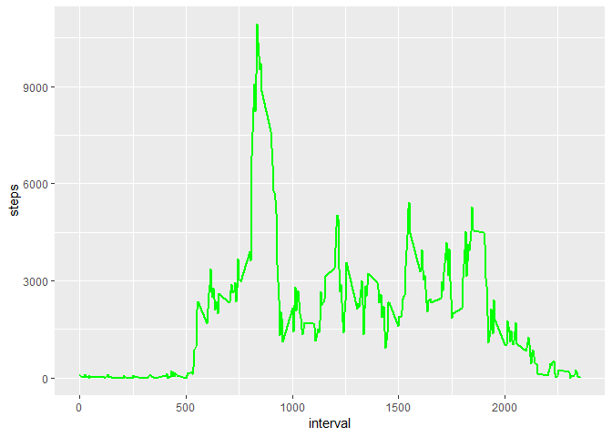
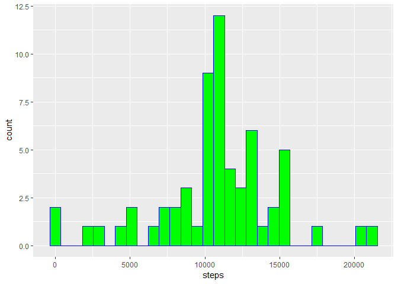

## Loading and preprocessing the data
#### Loaded the following libraies

```r
library(data.table)
library(ggplot2)
library(dplyr)
library(lubridate)
library(timeDate)
library(knitr)
```

#### Load in the data & create a set without NA's to be used later

```r
  myData<<-fread("activity.csv", sep=",",header=TRUE)
  myDataNA<<-na.omit(myData)
```


## What is mean total number of steps taken per day?
#### Create a data set that omits NA's, groups by date, and sums by Steps.  Then plots the results

```r
  mySumData<<-na.omit(summarise(group_by(myData,date),steps=sum(steps)))
  print(ggplot(mySumData,aes(steps))+geom_histogram(col="blue", fill="green"))
```

<!-- -->

#### Then determine the mean and median number of steps taken each day

```r
  myMMData<<-summarise(group_by(myDataNA,date), steps=sum(steps))
  print(data.table(Mean=mean(myMMData$steps),Median=median(myMMData$steps)))
```

```
##        Mean Median
## 1: 10766.19  10765
```

## What is the average daily activity pattern?
#### This time group the data by interval,and sum the steps again.  Then plot the results

```r
  myInterval<<-myDataNA %>%
    group_by(interval) %>%
    summarise(steps = sum(steps))
  print(g<-ggplot(myInterval,aes(interval,steps))+geom_line(col="green", size=1))
```

<!-- -->

#### From there let's determine Which 5-minute interval, on average across all the days in the dataset, contains the maximum number of steps

```r
  myIntervalAvg<<-myDataNA %>%
    group_by(interval) %>%
    summarise(steps = mean(steps))
  
  print(myIntervalAvg[which.max(myIntervalAvg$steps),][1,1])
```

```
## # A tibble: 1 x 1
##   interval
##      <int>
## 1      835
```


## Imputing missing values
#### I chose to replace NA's with the avearage for that inverval.

```r
  myDataFix<<-myData
  myDataFix[,stepsMean:=mean(steps,na.rm=TRUE), by=interval]
  myDataFix[is.na(steps),steps:=stepsMean]
```

```
## Warning in `[.data.table`(myDataFix, is.na(steps), `:=`(steps, stepsMean)):
## Coerced double RHS to integer to match the type of the target column
## (column 1 named 'steps'). One or more RHS values contain fractions which
## have been lost; e.g. item 1 with value 1.716981 has been truncated to 1.
```

#### Then let's create a histogram of the results by groupign by date, and sum the steps

```r
  mySumData2<<-summarise(group_by(myData,date),steps=sum(steps))
  print(ggplot(mySumData2,aes(steps))+geom_histogram(col="blue",fill="green"))
```

```
## `stat_bin()` using `bins = 30`. Pick better value with `binwidth`.
```

<!-- -->

#### Then show the average mean and median now that the NA's have been replaced with mean values.

```r
  print(data.table(mean=mean(mySumData2$steps),median=median(mySumData2$steps)))
```

```
##        mean median
## 1: 10749.77  10641
```

#### Finally let's export the new dataset incase someone else would like to use it.

```r
  fwrite(myDataFix[,1:3],file="fixedData.csv")
```


## Are there differences in activity patterns between weekdays and weekends?
